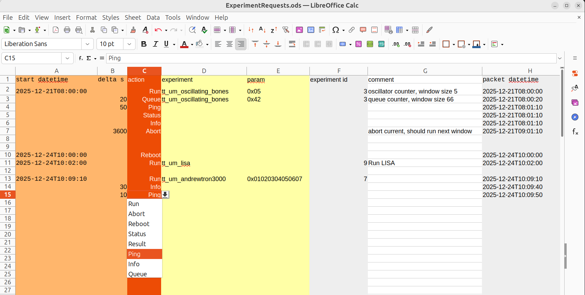

# SpASICs: Sending Commands To Experiments      
--------------------------------------------------------------------

[Pat Deegan](https://psychogenic.com)

2025-11-26: Launch Day!

## 1 Introduction

We have a whole [API](./ExperimentModuleAPI.md) to run commands, like launch experiments, query status, etc.

This system allows experiment creators to specify the particulars of launching their run and getting results.

The process is simply:

  1) load up the libreoffice [ExperimentRequests spreadsheet](./ExperimentRequests.ods)
  
  2) list commands to execute in each row
  
  3) get us your ods file, or a CSV export thereof
  


## 2 Spreadsheet

The spreadsheet is a simple means of setting up the sequence of commands and their timing.



### Timing

The start datetime is some semi-arbitrary datetime, subject to change. Have something in there and everything else just uses the `delta` column, where you can set it to wait 60 seconds or whatever.  We only have a granularity of 10 seconds, so use 10 second increments.


### Action

The action is the command to run.  A drop down is provided for valid actions.

### Experiment

For Run or Queue commands, an experiment must be specified.  Use the name, as per the second sheet in there, e.g. *tt_um_oscillating_bones*.

When setting up the run, you may provide a sequence of bytes as a parameter.  These bytes will be sent in "big-endian" order, meaning read from left to right, i.e.

```
0x01020304
```

The comment is optional, other columns are filled for you by the sheet and should be left as-is.

## 3 Translation

Under the hood, we take this information and use the [transaction_generator](../python/transaction_generator.py) module to convert this to a format that Tibor can use to issue commands.

This winds up looking something like this

```
I2C_EXPS_EVENT_SEND_COMMAND,0,0x56,0x0000000000000586
I2C_EXPS_EVENT_SEND_COMMAND,0,0x56,0x0000000000000345
I2C_EXPS_EVENT_SEND_COMMAND,-30,0x56,0x0000000000004286
I2C_EXPS_EVENT_SEND_COMMAND,-30,0x56,0x0000000000000396
I2C_EXPS_EVENT_SEND_COMMAND,-80,0x56,0x000000474e500150
```
