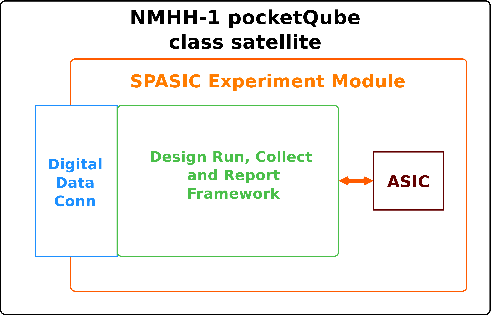

# SpASICs: ASIC Modular satellite experimentation board requirements      
--------------------------------------------------------------------

[Pat Deegan](https://psychogenic.com)

2025-03-26

### 1 Introduction

It may be possible for [Tiny Tapeout](https://tinytapeout.com/) to include an experiment module aboard a [pocketQube](https://en.wikipedia.org/wiki/PocketQube) class satellite and we would like to take advantage of this opportunity to put one of the ASICs produced into low earth orbit in order to run user and interact with user designs, to collect and report data from these runs back to Earth.

To attain this goal, three fundamental elements must be designed to work together:

1.  The experiment module: a physical PCB hosting ASIC and supporting components
    
2.  A software framework to schedule and perform runs of experiments, which will enable designs, interact with them, collect data and prepare it for reporting results; and
    
3.  The digital data connection: the means for the experiment module to communicate with and be controlled by the host satellite.
    

### 2 Objectives

The core objective is to get user designs operating in low earth orbit and, in doing so, acquire experience with and design tools for performing experiments in this constrained and unique environment.

The chips host a variety of designs submitted by creators and Tiny Tapeout is an educational project centred on education and community, so a collaborative model where designers can submit tests for particular projects is highly desirable. However,

because in these circumstances physical access is impossible and communications are extremely limited in both the amount of data that may be exchanged and the windows during which such exchanges are possible, the aim is to design a system that allows these user contributions while being resilient, fault-tolerant and simple.

#### 2.1 Experiment Module

The experiment module hardware is the physical PCB that may be hosted by the NMHH-1 pocketQube satellite. It’s objectives are to:

1.  Host a Tiny Tapeout ASIC and the minimal set of required supporting components for it to operate
    
2.  Meet the NMHH-1 requirements for 3PQ size pocketQube class satellite experiment modules and be suitable for inclusion in the launch
    
3.  Allow for communication between the satellite framework and the experiment run and data collection system
    

#### 2.2 Experiment Run and Data Collection Framework

##### 2.2.1 Experimental Run

An experimental run is the combination of:

1.  the specific design to enable on the ASIC
    
2.  any interaction required with the project, including clocking, values input through I/O and timing thereof
    
3.  data collection, including monitoring project outputs
    
4.  data processing, which condenses collected data into some form of result to be logged or returned back to base station
    
5.  reporting, i.e. providing information on the experimental run in an agreed-upon form
    

##### 2.2.2 Core Function

The base function of this framework is to run experiments on behalf of users. It will

1.  Maintain the set of potential design experiments
    
2.  Maintain the schedule of experimental runs
    
3.  Allocate time and processing to experimental runs according to the schedule
    
4.  Maintain records of experimental runs performed
    
5.  Collect, prepare and queue data reported by experimental runs
    
6.  Provide experimental run data to the Digital Data Communications layer on request
    
7.  Keep track of which reports are pending or have already been transmitted
    
8.  Be capable of reporting information on it’s own state, including health, information about up-time, experiment queue, global success rate
    

The objective is for this system to run autonomously. For example, if we suddenly could no longer communicate up to the satellite, we would still be able to receive regular reports on the set of design experiments as it was configured on last update.

##### 2.2.3 Management Function

In addition to its core function of actually performing experimental runs, the framework must allow for management functions that let us

1.  Enable or disable specific experimental runs
    
2.  Change the scheduling or weight of particular design experiments
    
3.  Set system-level parameters and limits, including system clock frequency
    
4.  Update experimental run execution code
    
5.  Update the platform firmware itself
    

These last two points are objectives that would be ideal to support but are subject to the extreme bandwidth constraints and difficult to implement in a manner that is guaranteed to be fault-tolerant, with item 4 potentially putting the entire platform at risk... further consideration needed here.

#### 2.3 Digital Data Communications with pocketQube

The pocketQube digital data communications protocol is a simple, 3 command, 100kHz I2C that treats the experiment module as a slave device and has only 3 commands:

1.  read
    
2.  write
    
3.  time synch
    

From our side, the objectives are

1.  Support handling the defined I2C messages addressed to our module and to general-call broadcasts
    
2.  Synchronize system time to satellite on reception of time synch broadcasts
    
3.  Have a clearly defined API which can be transported as payload data within the established read/write protocol
    
4.  Support all the functions of the Experiment Run and Data Collection Framework within the constraints of the limited throughput of the digital data communications protocol
    

### 3 Requirements

#### 3.1 Experiment Module

The experiment module PCB requirements and constraints are detailed in the “NMHH-1 3PQ size pocketQube class satellite Experiment Module” document (nmhh1\_experiments\_eng.pdf) and that document should be referred to for all details. Our module must at a minimum include

1.  a Tiny Tapeout ASIC
    
2.  a means to manage and interact with that ASIC, nominally an RP2040 MCU
    
3.  interconnects between the MCU and the ASIC
    
4.  supporting components, such as flash memory
    

#### 3.2 Experiment Run and Data Collection Framework

The software framework must:

1.  Be remotely updatable, at a minimum in terms of all code above the base micropython environment and data stored on the filesystem
    
2.  Prioritize responsivity and always being in a state that will react to remote commands and updates
    
3.  Allow for loading experiments in a modular fashion, without being vulnerable to faulty code within (meaning being able to recover from exceptions, crashes or hangs in user-submitted code)
    
4.  Provide a standardized mechanism for defining user-defined test units and including them within the schedule
    
5.  Provide a standardized means of reporting experimental run results
    
6.  Be able to run autonomously while supporting functions to manage scheduling, data stores and behaviour
    
7.  Be “re-entrant” in the sense that it minimizes losses to state to at most the data for a single run in progress should power interrupted at any moment
    
8.  Have a means to check and handle priority commands or start-up or at any point, in order to abort or amend work in progress
    

#### 3.3 Digital Data Communications with pocketQube

The Digital Data Comms layer must:

1.  Respond correctly to module-addressed and broadcast messages over the I2C bus
    
2.  Have priority over the experiment run and data collection framework, in order to respond in a timely manner to the satellite and allow for management regardless of experimental run behaviour
    
3.  Provide a means to safely override the assigned module address
    

### 4 Design Constraints

#### 4.1 Experiment Module

Refer to “NMHH-1 3PQ size pocketQube class satellite Experiment Module” document (nmhh1\_experiments\_eng.pdf) for all details. Important constraints to keep in mind include

1.  The PCB must match the prescribed footprint and may have a maximum height of 3mm (including the board itself), be single-sided, gold plated, use 60/40 tin-lead eutectic and not include silk screen
    
2.  Total weight may not exceed 50g
    
3.  Power supply is 3v3 (2.7V - 3.5V)
    
4.  Power draw is limited to 100mA bursts, with an average consumption (over 90 minutes) of at most 34mA
    

#### 4.2 Experiment Run and Data Collection Framework

The data collection framework’s main constraints are related to memory, namely

1.  that it be able to load itself and modular experimental runs within the limits of available RAM
    
2.  that it be able to rely on the flash memory as a store for programs and collected results
    

#### 4.3 Digital Data Communications with pocketQube

Constraints related to communications are:

1.  Speed: the I2C bus operates at 100kHz
    
2.  Bandwidth: read and write commands have fixed payloads and we must encapsulate both data and meta-information (commands) within
    

##### 4.3.1 Write command

Each write, from satellite to our module, is 8 bytes of data. This severely limits the amount of information we can transfer to the module, making things like updating code rather difficult as they would be forced into a great deal of transactions on the bus. Ignoring the case of large updates, simple commands could be structured as

COMMAND DATA\[6:0\]

allowing for 7 bytes of relevant payload for any given command, with a maximum of 256 distinct commands. This can be further broken down using subcommand bytes, e.g.

SETEXPERIMENT PARAM VALUE\[5:0\]

so we could define

SETEXPERIMENT DESIGNID LOWBYTE HIGHBYTE

or

SETEXPERIMENT WEIGHT VALUE

etc.

##### 4.3.2 Read command

On each read, the experiment module is expected to send exactly 16 bytes of data. The satellite can store up to 7 such reads (a total of 112 bytes) for transmission to base station. This implies that reads must either

*   Always return a specific type of data
    
*   Sacrifice a portion of those limited returned bytes as metadata, indicating the how to interpret bytes or
    
*   Be setup in some manner by a previous write, e.g. to request specific data on next read
    

### 5 Assumptions and Dependencies

Core assumptions to be confirmed or amended.

1.  Module will be powered on at least 6 hours of every 24
    
2.  Under standard operating conditions, power delivery will be uninterrupted for periods of at least 20 minutes

3.  While powered, over any period of 60 seconds there will always be at least one I2C data communication transaction addressed to the module
    
4.  Ambient/materials in physical contact with the experiment module will always be between -40 and +80 degrees Celsius
    
5.  Assuming a ground plane connected via 4x 0.5mm thermal reliefs to the large plated through hole in the centre of the PCB, in combination of mechanical fastening and electrical connectivity of the experiment module is sufficient to draw and dissipate a steady 115mW of waste heat.
    
6.  The satellite can hold and write blocks of at least 50kB of data to the experiment module (split into an appropriate number of 8 byte payload write transactions)
    
7.  Writes of larger blocks of data, as described in the previous point, will occur sequentially and over a period of continuously powered operation
    
8.  We may queue both simple write commands, sending data to the experiment module, and write+read sequences where we expect a blob of data to be written followed by a read, specifying how many read operations to perform (and hence how much data to retrieve for transmission)
    

### 6 Success Criteria

1.  The Experiment Module meets all the physical and electrical requirements and is installable within the pocketQube satellite
    
2.  The Experiment Module remains fully operational at any temperature between -40 and +80 degrees C, including during rapid changes in temperature
    
3.  The Experiment Run and Data Collection Framework responds appropriately to all supported commands
    
4.  The Experiment Run and Data Collection Framework remains responsive regardless of the nature and contents of  
    \- individual experiments  
    \- transmitted commands  
    \- uploaded updates
    
5.  The Experiment Run and Data Collection Framework runs experiments according to schedule and provides results for transmission back to earth
    

### 7 Future Iterations

TBD