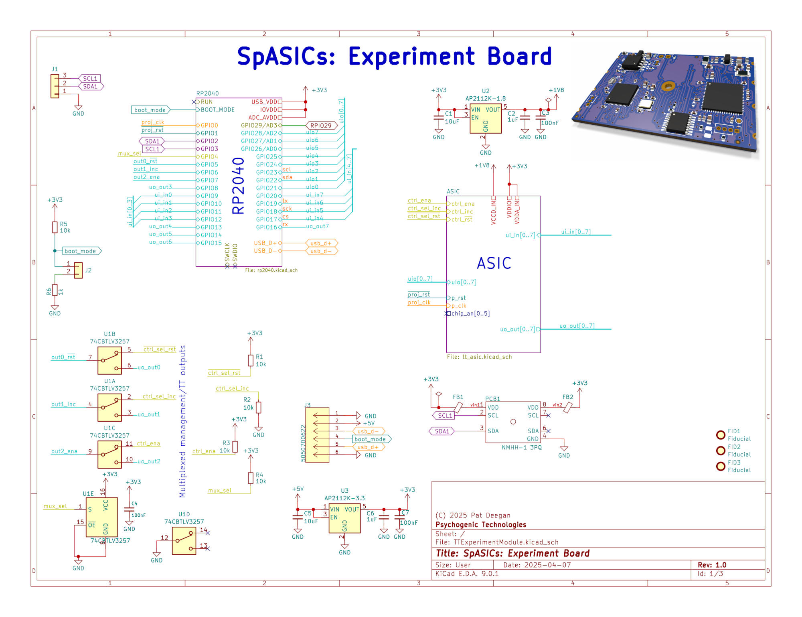
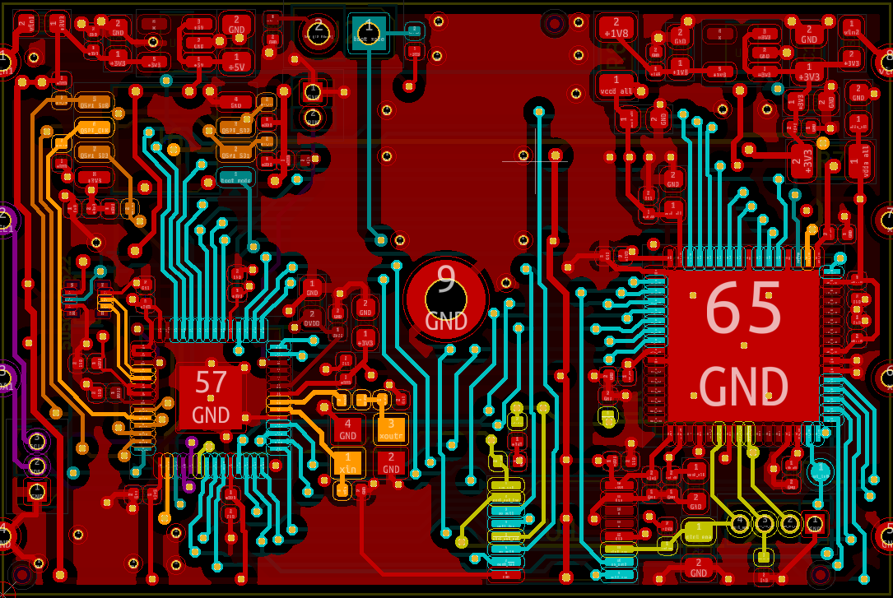

# Experiment Module Hardware

A single PCB created to host both the ASIC and the platform for the Experiment Run and Data Collection Framework (an RP2040) for inclusion within the [pocketQube](https://en.wikipedia.org/wiki/PocketQube) class satellite.

In addition to the meeting requirements related to being included in the launch (e.g. a 3mm height maximum, no silk screen, etc), a primary goals were to

  * provide a seamless path to running [SDK](https://github.com/TinyTapeout/tt-micropython-firmware) and existing ASIC project code with minimal disruption; and
  
  * reuse as much prior-tested components and circuitry
  
Thus, to the maximum extent possible, parts and pinouts were preserved, while major schematic elements were reproduced from the [demoboard](https://github.com/tinytapeout/tt-demo-pcb) and [ASIC breakout](https://github.com/tinyTapeout/breakout-pcb).

## Board 

[Explore the design online using KiCanvas](https://kicanvas.org/?github=https%3A%2F%2Fgithub.com%2Fpsychogenic%2Fspasics%2Ftree%2Fmain%2Fhardware%2FTTExperimentModule)

The basic schematic is

and you can consult the entire schematic in [the PDF](image/TTExperimentModule.pdf).

The PCB is 45x30mm and is mainly concerned with routing I/O around the big hole in the middle of the board.

## Sources

The entire [KiCad](https://www.kicad.org/) project is in [TTExperimentModule](./TTExperimentModule)

